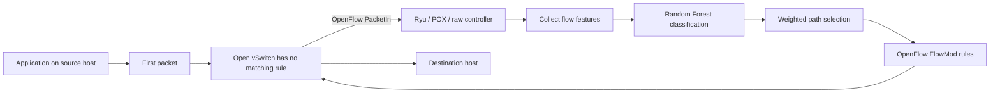
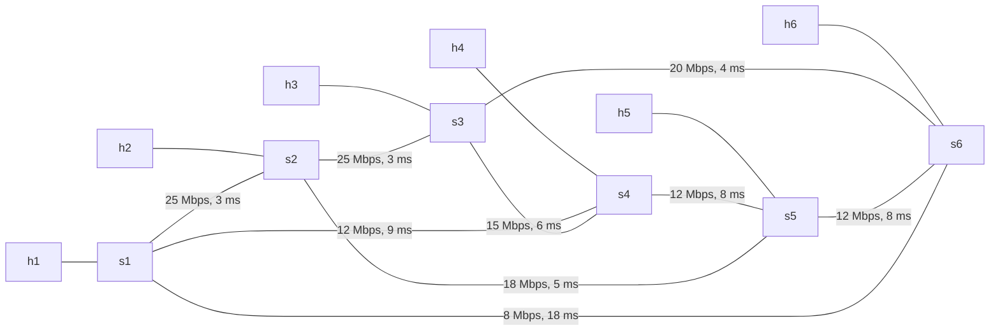
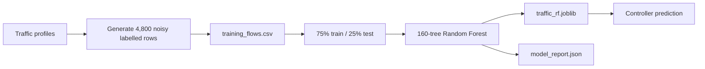

# AI-Assisted SDN Project — Complete Beginner-to-Viva Guide

> Project folder: `computer_network_rohan`  
> Purpose: teach this project from zero, explain why every part exists, trace how it works, and prepare for code-level viva questions.  
> Important: this guide describes what the current code **actually does**, including its limitations. It does not pretend that synthetic results are real measurements.

---

## 1. The project in one sentence

This project builds a small virtual network whose central SDN controller examines a new flow, uses a Random Forest model to label it as VoIP, video, file transfer, or web traffic, chooses a path using that class's delay/bandwidth/congestion priorities, and installs OpenFlow rules in the virtual switches.

## 2. The simplest mental picture

Think of the network as a city:

- **Hosts (`h1`–`h6`)** are houses that send and receive data.
- **Switches (`s1`–`s6`)** are road junctions.
- **Links** are roads with speed limits (bandwidth) and travel time (delay).
- **Packets** are vehicles; a related stream of packets is a **flow**.
- The **SDN controller** is a central traffic police office.
- **OpenFlow** is the language used between the traffic office and junctions.
- The **AI classifier** guesses whether a vehicle stream is a call, video, file, or web flow.
- The **routing algorithm** chooses the road suited to that flow.
- **Mininet** builds the entire city virtually on one Linux machine.

The first packet of an unknown flow causes a switch to ask the controller what to do. The controller makes a decision and installs a rule. Later matching packets can be forwarded directly by the switch without asking again.



## 3. What problem is being solved?

Ordinary shortest-path routing may send all applications down the same route. But applications have different Quality of Service (QoS) needs:

| Traffic | Main need | Why |
|---|---|---|
| VoIP | Very low delay | Late voice packets make calls awkward or unusable |
| Video | Bandwidth plus stable delay | Video needs a steady stream and enough capacity |
| File transfer | High throughput | Completion speed matters more than a few milliseconds |
| Web | Fast, congestion-aware bursts | Pages consist of irregular short requests and responses |

The project's idea is therefore: **classify first, then route according to the class**.

## 4. Technologies and their jobs

| Technology | Job in this project |
|---|---|
| Python | Implements generation, training, routing, controllers, experiments, and documentation |
| Mininet | Creates virtual hosts, links, and switches on Linux |
| Open vSwitch (OVS) | Acts as the programmable OpenFlow switch |
| OpenFlow 1.0 | Protocol used by controller and switches |
| Ryu | Full controller framework and packet parser |
| POX | Lightweight older controller framework |
| Raw sockets + `struct` | Third implementation that builds OpenFlow messages manually |
| scikit-learn | Supplies `RandomForestClassifier` and evaluation tools |
| pandas / NumPy | Tabular model and result processing |
| joblib | Saves and loads the trained model |
| matplotlib | Creates result graphs |
| iperf | Produces UDP/TCP traffic and measures throughput |
| `tc netem` via Mininet `TCLink` | Applies configured link bandwidth, delay, jitter, and loss |

Why OpenFlow 1.0? It gives a common version supported conveniently by Ryu, POX, and the hand-written raw controller, making the three implementations comparable at the protocol level.

## 5. Network foundations you must know

### 5.1 Packet, frame, flow, and protocol

- An **Ethernet frame** contains MAC addresses and carries ARP or an IP packet.
- An **IP packet** contains source/destination IP addresses and a protocol number.
- TCP has IP protocol number **6**; UDP has **17**; ICMP has **1**.
- TCP/UDP add source and destination **ports**, such as HTTP port 8080.
- A **5-tuple flow key** is `(source IP, destination IP, source port, destination port, IP protocol)`.
- The code treats direction separately: A→B and B→A are different flow keys.

### 5.2 MAC versus IP versus port

| Item | Identifies | Example here |
|---|---|---|
| MAC address | A network interface at layer 2 | `00:00:00:00:00:01` |
| IP address | A host at layer 3 | `10.0.0.1` |
| Transport port | An application/service at layer 4 | UDP 5060 for modeled VoIP |
| Switch port | A physical/virtual switch connector | `s1` port 2 leads to `s2` |

Do not confuse transport port 5060 with an OpenFlow output port such as 2. They are unrelated number spaces.

### 5.3 ARP

ARP asks “which MAC address owns this IP?” Before normal IP traffic works, hosts often exchange ARP messages. Each controller handles ARP separately and routes it using a path calculated with the web profile. `autoStaticArp=True` also pre-populates host ARP entries in the Mininet runs, reducing ARP dependence.

### 5.4 SDN planes

- **Data plane:** OVS switches forward packets quickly according to installed rules.
- **Control plane:** the Python controller decides those rules.
- **Southbound interface:** OpenFlow communication from controller to switches.
- The project has no separate northbound API; configuration is directly in Python.

## 6. Exact topology

Every host has one 100 Mbps access link to its matching switch: `h1-s1`, `h2-s2`, ..., `h6-s6`. Host links have 1 ms nominal delay and small jitter.



| Switch link | Bandwidth | Delay | Jitter |
|---|---:|---:|---:|
| s1–s2 | 25 Mbps | 3 ms | 0.45 ms |
| s2–s3 | 25 Mbps | 3 ms | 0.55 ms |
| s3–s6 | 20 Mbps | 4 ms | 0.70 ms |
| s1–s4 | 12 Mbps | 9 ms | 1.40 ms |
| s4–s5 | 12 Mbps | 8 ms | 1.20 ms |
| s5–s6 | 12 Mbps | 8 ms | 1.35 ms |
| s2–s5 | 18 Mbps | 5 ms | 0.85 ms |
| s3–s4 | 15 Mbps | 6 ms | 1.00 ms |
| s1–s6 | 8 Mbps | 18 ms | 2.50 ms |

Multiple links are essential: without alternative paths, traffic-aware routing would have no decision to make.

### 6.1 Address and switch-port mapping

`hN` gets IP `10.0.0.N`, MAC ending in hexadecimal `N`, and connects to port 1 of `sN`. A switch's datapath ID (DPID) is its number: `s4` has DPID 4.

| Switch | Port 1 | Port 2 | Port 3 | Port 4 |
|---|---|---|---|---|
| s1 | h1 | s2 | s4 | s6 |
| s2 | h2 | s1 | s3 | s5 |
| s3 | h3 | s2 | s6 | s4 |
| s4 | h4 | s1 | s5 | s3 |
| s5 | h5 | s4 | s6 | s2 |
| s6 | h6 | s3 | s5 | s1 |

This hard-coded port table must agree with Mininet's link creation order. The code relies on it when converting a selected next hop into an output-port number.

## 7. Traffic definitions

`TrafficType` is a string-backed Python `Enum`. It restricts labels to four valid values and still serializes naturally as text.

`TrafficProfile` is an immutable (`frozen=True`) dataclass holding ports, feature ranges, expected bandwidth, priority, and cost weights.

| Type | Modeled ports | Packet size | Interarrival | Demand | Priority | Weights D/B/C |
|---|---|---:|---:|---:|---:|---|
| VoIP | 5060, 5061, 10000–10002 | 120–240 B | 10–25 ms | 0.12 Mbps | 4 | .70/.10/.20 |
| Video | 5004, 5005, 1935, 8554 | 950–1400 B | 18–45 ms | 6 Mbps | 3 | .25/.50/.25 |
| File | 20, 21, 989, 990, 8081 | 1200–1500 B | 1–8 ms | 10 Mbps | 1 | .05/.80/.15 |
| Web | 80, 443, 8080, 8443 | 180–1100 B | 40–450 ms | 1 Mbps | 2 | .35/.25/.40 |

These are project assumptions, not universal laws. Real encrypted traffic can share port 443 and real application behavior is more complex.

## 8. AI pipeline from beginning to end



### 8.1 Training data generation

`ai/generate_training_data.py` produces 1,200 rows for each of four classes, therefore 4,800 rows plus a header. Seed 7 makes the pseudo-random output repeatable.

Each row has:

| Column | Meaning |
|---|---|
| `packet_size` | Observed bytes, clamped to 60–1500 |
| `interarrival_ms` | Time from previous packet, clamped to 0.2–1000 ms |
| `src_port` | Random client/ephemeral port, 1024–65000 |
| `dst_port` | Chosen application port, sometimes replaced by shared port |
| `service_port` | `min(src_port, dst_port)`; normally the well-known server port |
| `label` | Ground truth: file/video/voip/web |

Noise is deliberately added so the model cannot win only by memorizing ports:

- 35% shared-port probability using 443, 8080, or 8443;
- Gaussian packet-size jitter of about 12%;
- log-normal interarrival jitter;
- 15% chance of a burst/outlier;
- rows are shuffled after generation.

The label remains the intended application class even when noise changes its observation.

### 8.2 Training

`ai/train_model.py` loads the CSV with pandas. `train_test_split` uses 75% for learning and 25% for testing, `stratify` keeps equal class proportions, and `random_state=7` makes the split repeatable.

Random Forest settings:

- `n_estimators=160`: build 160 decision trees;
- `max_depth=12`: limit each tree to reduce overfitting;
- `min_samples_leaf=2`: a leaf needs at least two training samples;
- `class_weight="balanced"`: compensate for class imbalance (the current generated data is already balanced);
- `n_jobs=-1`: use all available CPU cores;
- the forest predicts by aggregating tree votes.

The saved joblib bundle contains both the fitted model and feature order. Feature order matters: a model trained as `[size, time, src, dst, service]` must receive prediction values in exactly that order.

### 8.3 Evaluation terms and current result

- **Accuracy:** correct predictions / all predictions.
- **Precision for a class:** among samples predicted as that class, how many were correct.
- **Recall:** among real samples of that class, how many were found.
- **F1:** harmonic balance of precision and recall.
- **Confusion matrix:** row is actual class and column is predicted class.

The saved report shows **0.980833... = 98.0833% test accuracy**, or 1,177 correct out of 1,200 test rows. This is high partly because both training and testing are generated from the same synthetic assumptions. It does not prove 98% performance on real internet traffic.

### 8.4 Runtime prediction and fallback

`TrafficClassifier` loads `models/traffic_rf.joblib`, makes a one-row pandas DataFrame, calls `model.predict`, and converts the returned string into `TrafficType`.

`ControllerBrain` catches model/dependency/file loading failures. If unavailable, it classifies by matching destination port, then source port; if neither matches, it defaults to web. This fallback lets networking still run but is no longer AI classification.

## 9. Per-flow feature tracking

`FlowStats` stores packet count, byte total, first/last seen time, last arrival, and total interarrival time. It uses `time.monotonic()` because elapsed-time measurement should not jump when the system clock changes.

On every observed packet:

1. add `(now - last_arrival) × 1000` to total interarrival time;
2. update timestamps;
3. increment packet count;
4. add packet bytes;
5. calculate average size and average interarrival safely.

For the first packet, average interarrival is 0 because no previous packet exists. Note that runtime classification currently passes the **current packet size**, not `stats.avg_packet_size`, even though average packet size is implemented.

## 10. The actual routing algorithm

The current implementation is **not Dijkstra**. `_simple_paths` performs a depth-first search using a stack, enumerates every loop-free path up to the number of graph nodes, computes each complete path's cost, and chooses the minimum. Tie-breaking uses cost, then path length, then alphabetical tuple order.

For a path:

```text
delay = sum of link delays
bottleneck = minimum link bandwidth
inverse_bandwidth = 100 / bottleneck
congestion = 100 × average link utilization
loss_penalty = 20 × sum of link loss percentages

cost = delay_weight × delay
     + bandwidth_weight × inverse_bandwidth
     + congestion_weight × congestion
     + loss_penalty
```

Lower cost wins. Bandwidth is inverted because a higher bandwidth should produce a smaller penalty.

### 10.1 Worked path example

For `s1 → s2 → s3 → s6` with no congestion:

- delay = 3 + 3 + 4 = 10 ms;
- bottleneck = min(25, 25, 20) = 20 Mbps;
- inverse bandwidth = 100 / 20 = 5;
- congestion and loss = 0.

VoIP cost = `0.70×10 + 0.10×5 = 7.5`.  
File cost = `0.05×10 + 0.80×5 = 4.5`.

The direct `s1 → s6` path has delay 18 and bandwidth 8. Its VoIP cost is `0.70×18 + 0.10×12.5 = 13.85`, so the multi-hop path wins despite having more hops.

At initial zero utilization, all four traffic types currently choose `s1-s2-s3-s6`. Different weights become more meaningful when utilization changes or when examining other endpoint pairs.

### 10.2 Congestion model

When a newly selected flow is applied to a link:

```text
added utilization = traffic demand Mbps / link bandwidth Mbps
new utilization = min(1.0, old + added)
```

Both directions receive the same utilization value. After each decision all link estimates are multiplied by 0.94, simulating old traffic fading away. A link is overloaded at utilization ≥ 0.80.

`should_reroute` never reroutes priority-4 VoIP. Any other existing flow is eligible if a link in its current path crosses the threshold.

This is an internal estimated load model. The real controllers do **not** poll OVS port counters, so it is not measured live utilization.

## 11. The shared controller brain

`common/controller_logic.py` prevents the three controllers from having three different AI/routing policies.

For each packet metadata object, `decide()`:

1. maps source and destination IPs to known hosts; unknown IPs return `None`;
2. creates the directional 5-tuple flow key;
3. updates that flow's timing and byte statistics;
4. predicts the traffic class or uses fallback classification;
5. maps hosts to their attached switches;
6. checks whether a saved path should be rerouted;
7. selects and saves a path for a new/rerouted flow;
8. adds estimated load for that path;
9. otherwise preserves the old path;
10. decays all utilization estimates;
11. returns the flow key, class, path decision, and reroute flag.

## 12. OpenFlow packet lifecycle

1. OVS connects by TCP to controller port 6633 and negotiates OpenFlow 1.0.
2. A packet without a matching switch rule produces `PacketIn`.
3. Controller parses ARP, IPv4, TCP, and UDP fields.
4. Shared brain classifies and routes.
5. Controller sends a `FlowMod` to each currently connected switch on the path.
6. Match fields are EtherType IPv4, source/destination IP, IP protocol, and transport ports.
7. Action is output to one switch port.
8. Priority is 100; idle timeout is 30 seconds; hard timeout is 0 (no fixed lifetime).
9. A `PacketOut` releases the triggering packet immediately.
10. The reverse direction creates its own rule when first seen.

`idle_timeout=30` means the rule disappears after 30 seconds without a matching packet. `hard_timeout=0` means it has no maximum lifetime while active.

## 13. Three controller implementations

### 13.1 Ryu controller

`controllers/ryu_ai_controller.py` subclasses `RyuApp` and declares OpenFlow 1.0. Its event decorator calls `packet_in_handler` for `EventOFPPacketIn`. Ryu's packet library parses ARP/IPv4/TCP/UDP; parser objects build `OFPMatch`, `OFPFlowMod`, and `OFPPacketOut` messages.

The fallback classes at the top are only there so the file can be imported/compiled on a machine without Ryu. They do not provide a functioning controller.

### 13.2 POX controller

`controllers/pox_ai_controller.py` registers listeners with `core.openflow`. `_handle_ConnectionUp` remembers switch connections; `_handle_PacketIn` handles packets. POX message classes build flow modifications and packet outputs.

Unlike Ryu, IPv4 and ARP headers are manually extracted from byte offsets with `struct` and `socket.inet_ntoa`. `launch()` is the entry point POX expects.

### 13.3 Raw controller

`controllers/raw_openflow_controller.py` demonstrates what frameworks hide:

- opens a TCP server on `0.0.0.0:6633`;
- accepts each switch in a daemon thread;
- sends OpenFlow HELLO and FEATURES_REQUEST;
- reads exactly the 8-byte OpenFlow header, then its payload;
- learns DPID from FEATURES_REPLY;
- handles PACKET_IN;
- packs PACKET_OUT and FLOW_MOD bytes using network byte order (`!` in `struct`);
- uses transaction IDs (`xid`) to identify protocol messages.

Constants such as message type 10 for PacketIn and special port `0xFFFB` for flood come from OpenFlow 1.0. `_recv_exact` is necessary because one TCP `recv` call is not guaranteed to return a complete message.

### 13.4 What is shared and what differs?

| Part | Shared? |
|---|---|
| Model, features, classification | Yes, `ControllerBrain` |
| Graph, cost, utilization, reroute policy | Yes |
| Packet parsing | No; framework/manual implementations differ |
| OpenFlow message creation | No |
| Decision log file | Separate JSONL per controller |

## 14. Mininet and real traffic

`SixSwitchTopo.build()` delays Mininet imports until called, allowing non-Linux machines to import or syntax-check the project. It creates hosts, forces switches to `OpenFlow10`, and adds `TCLink` properties.

`Mininet` uses:

- `RemoteController`: connect OVS to the separately running controller;
- `OVSKernelSwitch`: kernel-backed OVS;
- `TCLink`: enforce bandwidth/delay/jitter/loss;
- `autoSetMacs=True`: deterministic host MACs;
- `autoStaticArp=True`: pre-fill ARP mappings.

### 14.1 Generated flows

| Source→destination | Type | Server | Client idea |
|---|---|---|---|
| h1→h6 | VoIP | UDP iperf on 5060 | 120 Kbps, 160-byte datagrams |
| h2→h5 | Video | UDP iperf on 5004 | 6 Mbps, 1200-byte datagrams |
| h3→h4 | File | TCP iperf on 8081 | Send as fast as TCP permits |
| h4→h1 | Web | Python HTTP server 8080 | Irregular URL requests |

The driver starts all selected servers, waits 0.2 seconds after each, starts clients concurrently, waits for clients, then terminates servers. `--dry-run` only prints the plan because the normal function needs a live Mininet `net` object.

`web_bursts.py` repeatedly opens a URL, reads 256–4096 bytes, sleeps randomly 0.2–1.8 seconds, and continues until duration ends. Exceptions are reported without killing the generator.

### 14.2 Experiment launcher

`run_mininet_experiment.py` starts the topology and measures:

1. `pingAll()` packet-loss percentage and elapsed time;
2. selected traffic profile elapsed time;
3. final h1–h6 TCP iperf result and elapsed time;
4. writes those values to JSON even after network cleanup.

`finally: net.stop()` is crucial: it cleans virtual network state even after an error.

## 15. Synthetic comparison—what it really means

`experiments/run_comparison.py` works without Mininet. It creates 240 simulated packet events per controller profile by default. There is a 55% chance of selecting an existing flow; otherwise it creates one. Class mix is 25% VoIP, 25% video, 30% file, 20% web.

The same real `ControllerBrain` performs classification and routing, but the following are formulas/assumptions rather than OS measurements:

- controller installation overhead ranges;
- controller CPU base and jitter;
- path throughput estimate;
- path delay estimate;
- congestion handling score.

Ryu, POX, and raw profiles use different random seeds (`seed`, `seed+1`, `seed+2`) as well as assumed overheads. Therefore this is a repeatable demonstration, not a scientifically controlled benchmark of the actual running controller processes.

### 15.1 Output metrics

- `throughput_mbps`: estimated available bottleneck throughput;
- `delay_ms`: nominal path delay inflated by utilization plus random 0.2–2.5 ms;
- `install_ms`: actual Python brain execution time plus assumed controller overhead;
- `cpu_percent`: assumed base/jitter plus 2% per overloaded link;
- `rerouted`: shared brain changed an eligible flow's path;
- `congestion_events`: rows in which at least one overloaded link existed;
- `congestion_handling_score`: handled events / congestion events.

Current summary:

| Controller | Throughput | Delay | Install | CPU | Reroutes | Score |
|---|---:|---:|---:|---:|---:|---:|
| POX | 2.813 Mbps | 16.778 ms | 39.342 ms | 18.533% | 27 | 0.241 |
| Raw | 3.116 Mbps | 14.830 ms | 32.149 ms | 13.558% | 16 | 0.145 |
| Ryu | 3.175 Mbps | 14.084 ms | 30.986 ms | 22.513% | 21 | 0.223 |

Do not claim from this table that Ryu is definitively fastest or raw uses exactly 13.558% CPU in reality.

### 15.2 Real saved Mininet evidence

The `*_wsl_run.json` files are real WSL2/Mininet run summaries. Each used mixed traffic for 8 seconds and reported 0% `pingAll` loss plus about 19.0/18.9 Mbit/s h1–h6 iperf. Their different ping/traffic elapsed times alone do not prove controller superiority; repeated controlled trials would be required.

## 16. Every directory and file

### Root

| File | Why it exists |
|---|---|
| `README.md` | Short project overview and run commands |
| `PROJECT_A_TO_Z_GUIDE.md` | This full learning/viva guide |
| `requirements.txt` | Normal Python packages for AI, analysis, and graphs |
| `requirements-mininet.txt` | Includes normal requirements and adds Ryu |
| `.gitignore` | Prevents cache, virtual environment, and editor junk from Git |

### `common/`

| File | Responsibility |
|---|---|
| `traffic_types.py` | Enum, profiles, weights, priorities, port lookup |
| `topology.py` | Canonical hosts, switches, links, IP/MAC/port maps |
| `routing.py` | Simple-path enumeration, cost, congestion, load/decay |
| `flow_features.py` | Flow timing/byte statistics and model feature vector |
| `controller_logic.py` | Shared classify-route-reroute state machine |
| `__init__.py` | Marks directory as importable package |

### `ai/`

| File | Responsibility |
|---|---|
| `generate_training_data.py` | Makes noisy labelled synthetic CSV |
| `train_model.py` | Splits, trains, evaluates, saves model/report |
| `classifier.py` | Loads model and predicts one observation |
| `__init__.py` | Package marker |

### `controllers/`

| File | Responsibility |
|---|---|
| `ryu_ai_controller.py` | Ryu event-driven OpenFlow implementation |
| `pox_ai_controller.py` | POX component implementation |
| `raw_openflow_controller.py` | Socket-level OpenFlow 1.0 implementation |
| `__init__.py` | Package marker |

### `topologies/` and `traffic/`

| File | Responsibility |
|---|---|
| `six_switch_topology.py` | Constructs topology and optional interactive CLI |
| `run_mininet_experiment.py` | Automated real network run and JSON metrics |
| `traffic/profiles.py` | Server/client shell command templates |
| `traffic/mininet_traffic_driver.py` | Starts/stops processes inside hosts |
| `traffic/web_bursts.py` | Irregular HTTP client behavior |
| each `__init__.py` | Package marker |

### `experiments/`, `scripts/`, `data/`, and `models/`

| File | Responsibility |
|---|---|
| `experiments/run_comparison.py` | Synthetic events, aggregation, plots |
| `experiments/inspect_path_choices.py` | Prints s1→s6 decisions and reasons |
| `scripts/run_synthetic_comparison.ps1` | Windows two-command convenience script |
| `scripts/run_synthetic_comparison.sh` | Bash equivalent; strict shell flags stop on errors/unset vars |
| `data/training_flows.csv` | 4,800 generated labelled model samples |
| `models/traffic_rf.joblib` | Serialized trained Random Forest bundle |

### `results/`

| Pattern/file | Meaning |
|---|---|
| `model_report.json` | Accuracy, per-class metrics, confusion matrix, noise config |
| `comparison_raw.csv` | 720 rows: 240 synthetic events × 3 profiles |
| `comparison_summary.csv/.json` | Aggregated synthetic controller table |
| six `.png` graphs | Visual forms of synthetic summary and class delay |
| `mininet_*_run.json` | Saved Mininet experiment summaries |
| `*_wsl_run.json` | WSL2-verified real Mininet summaries |
| `*_decisions.jsonl` | One JSON object per controller decision; append-friendly logs |
| `raw_noise_smoke_decisions.jsonl`, `mininet_noise_smoke.json` | Smoke-test artifacts for noisy setup |

JSONL uses one complete JSON record per line, so a controller can append without loading and rewriting the entire file.

### `docs/` and generated/cache files

- `TECHNICAL_DOCUMENT.md` is the older concise technical explanation. Its Dijkstra statement is inaccurate for current code; use this guide for the actual algorithm.
- `AI_SDN_Laptop_Run_Guide.docx` is a generated beginner run manual.
- `build_laptop_run_guide.py` generates that Word document with `python-docx`. Helper functions style cells/runs, set margins and repeating headers, prevent row splitting, create code/note/bullet blocks, configure page fields, and build installation/run/troubleshooting chapters.
- `__pycache__/` and `.pyc` are Python bytecode caches generated automatically for faster imports. They are not source code, should not be edited, and are ignored by Git.

## 17. How to run it

Always run module commands from the project root so imports and relative model/result paths resolve correctly.

### 17.1 Windows quick/synthetic run

```powershell
python -m pip install -r requirements.txt
python -m ai.train_model --regenerate-data
python -m experiments.inspect_path_choices
python -m experiments.run_comparison --events 240 --output-dir results
```

Or: `powershell -ExecutionPolicy Bypass -File scripts/run_synthetic_comparison.ps1`.

### 17.2 Linux/WSL2 real Mininet run

```bash
sudo apt update
sudo apt install -y mininet openvswitch-switch iperf python3-pip
python3 -m pip install -r requirements-mininet.txt
python3 -m ai.train_model --regenerate-data
```

Terminal 1, choose exactly one controller:

```bash
ryu-manager --ofp-tcp-listen-port 6633 controllers/ryu_ai_controller.py
# OR POX using the README command
# OR
python3 -m controllers.raw_openflow_controller --port 6633
```

Terminal 2:

```bash
sudo env PYTHONPATH="$PWD" python3 -m topologies.run_mininet_experiment \
  --controller-ip 127.0.0.1 --controller-port 6633 \
  --profile mixed --duration 30 --output results/mininet_run.json
```

If Mininet is left dirty after interruption: `sudo mn -c`.

## 18. Python/code syntax used throughout

| Syntax | Meaning |
|---|---|
| `from __future__ import annotations` | Defers type-hint evaluation and improves compatibility |
| `@dataclass` | Auto-generates constructor/representation for data containers |
| `frozen=True` | Prevents normal field reassignment after construction |
| `Type | None` | Value may be that type or `None` |
| `tuple[str, ...]` | Tuple containing any number of strings |
| `dict[K, V]` | Mapping from key type K to value type V |
| `Path` | Cross-platform filesystem path object |
| `with ...` | Context manager; reliably closes file/socket/resource |
| `try/finally` | Always run cleanup even when an exception occurs |
| `if __name__ == "__main__"` | Run CLI entry point only when file/module is executed |
| `argparse` | Parses command-line options and generates help |
| `zip(path, path[1:])` | Produces consecutive edges `(node0,node1)`, `(node1,node2)` |
| `setdefault(key, FlowStats())` | Return existing stats or insert default |
| `getattr(x, "src_port", 0)` | Safely get attribute or use zero |
| `removeprefix("s")` | Converts name like `s4` toward numeric `4` |

## 19. Important limitations and examiner traps

Knowing limitations demonstrates understanding, not failure.

1. **Synthetic training data:** the model has not been validated on packet captures from real applications.
2. **Synthetic benchmark:** CPU and controller overhead in `run_comparison.py` are assumed/randomized, not measured processes.
3. **Routing is exhaustive DFS, not Dijkstra:** acceptable for six switches, but simple paths can grow exponentially in a large network.
4. **Utilization is estimated:** controllers do not request OpenFlow port statistics.
5. **First-packet timing is zero:** this can make the first prediction weaker.
6. **Classification may change:** every PacketIn is classified again; a flow label is not separately locked.
7. **Installed rules reduce observations:** once a rule exists, later packets normally stay in the data plane, so the controller may not see enough packets to calculate rich timing statistics.
8. **Reroute enforcement is incomplete:** the brain can choose a new path, but old switch rules are not explicitly deleted. Active matching traffic may use old rules until idle expiry or a new PacketIn.
9. **Forward only:** rules for the reverse direction are installed only when reverse packets independently trigger the controller.
10. **Saved cost detail:** when preserving a previous path, `ControllerBrain` obtains the cost from a newly chosen path and then substitutes the old path; the reported `PathDecision.cost` can therefore belong to a different path. Controllers currently log path, not cost, so forwarding is unaffected.
11. **ICMP has ports 0/0:** `pingAll` packets can still enter AI prediction even though the model was trained with TCP/UDP-like nonzero ports. Saved logs show ICMP sometimes changing predicted class.
12. **Hard-coded topology/ports:** topology discovery via LLDP is not implemented.
13. **Raw controller concurrency:** multiple switch threads share brain, dictionaries, logs, and transaction counter without locks.
14. **No security:** controller channel is plain TCP; no TLS/authentication or malicious-flow defense.
15. **Scale:** all path enumeration, pandas per prediction, and synchronous JSONL writes are fine for a classroom topology but inefficient at production scale.
16. **No queues/meters:** traffic priority affects routing/rerouting policy but does not configure OVS QoS queues.

## 20. Common failures and diagnosis

| Symptom | Likely cause | Fix/check |
|---|---|---|
| `ModuleNotFoundError: common` | Command run outside root / PYTHONPATH absent | `cd` to root; set `PYTHONPATH="$PWD"` |
| Model fallback used | Missing/corrupt joblib or missing sklearn/joblib | run `python -m ai.train_model` |
| `mininet` not found | Running on Windows or package absent | use WSL2/Ubuntu and install apt package |
| Controller connection refused | Controller not started or wrong port | verify terminal 1 and 6633 |
| Address already in use | another controller owns 6633 | stop it or use matching alternate port |
| Switch connects but no traffic | OpenFlow version mismatch or bad port map | force OpenFlow10 and inspect controller log |
| iperf command absent | `iperf` not installed | `sudo apt install iperf` (project uses iperf 2 syntax) |
| Stale Mininet interfaces | prior run interrupted | `sudo mn -c` |
| Empty/odd logs | logs append across runs | preserve/archive, then clear intentionally before a controlled run |
| POX import error | POX not on `PYTHONPATH` | follow clone/copy command in README |

## 21. Viva questions with short answers

1. **What is the project objective?** Classify traffic and choose an application-aware path in a virtual SDN.
2. **Why SDN?** It separates centralized control decisions from switch forwarding.
3. **Why multiple paths?** Without alternatives, class-aware routing cannot choose differently.
4. **What is OpenFlow?** A controller-switch protocol for events, flow rules, and actions.
5. **Why OpenFlow 1.0?** Common convenient support across Ryu, POX, and raw implementation.
6. **What triggers PacketIn?** A packet misses the switch flow table (or a rule sends it to controller).
7. **What is a FlowMod?** Controller message adding/modifying/deleting a switch flow rule.
8. **What is PacketOut?** Controller instruction to release/output a particular packet.
9. **What is the flow key?** Source IP, destination IP, source port, destination port, protocol.
10. **Why directional keys?** Forward and reverse traffic can differ and require separate rules.
11. **Which AI algorithm?** Random Forest classification with 160 decision trees.
12. **Why Random Forest?** It handles nonlinear mixed features, needs little preprocessing, and is robust for tabular data.
13. **Is this supervised learning?** Yes; each training row has a known class label.
14. **What are the five features?** Packet size, interarrival time, source port, destination port, service port.
15. **Why service port?** Client ports are usually large/random; the lower port often identifies the service.
16. **Why add noise?** To reduce trivial port memorization and mimic observation variation.
17. **What is current accuracy?** About 98.08% on the held-out synthetic test set.
18. **Does that guarantee real accuracy?** No; real-data validation is missing.
19. **What if model load fails?** Port-based classification, then default web.
20. **What does stratify do?** Preserves class proportions in train and test sets.
21. **What does random seed do?** Makes generated samples/splits/experiments repeatable.
22. **What makes VoIP special?** Highest delay weight and priority 4; it is not rerouted by congestion policy.
23. **Why inverse bandwidth?** High bandwidth should lower path cost.
24. **What is bottleneck bandwidth?** Minimum bandwidth among links on a path.
25. **What is congestion threshold?** Utilization 0.80 or higher.
26. **How is load estimated?** Demand divided by link capacity, capped at 1.0.
27. **Why decay utilization?** Simulate flows finishing and load aging without explicit lifecycle tracking.
28. **Does routing use Dijkstra?** No; current code enumerates simple paths with DFS and minimizes full-path cost.
29. **Why is that okay here?** The graph has only six switches.
30. **What differs among controllers?** Framework/event/parsing/message construction; the decision brain is shared.
31. **Advantage of Ryu?** Rich event and packet/OpenFlow abstractions.
32. **Advantage of POX?** Lightweight and educational.
33. **Advantage of raw controller?** Shows wire-format mechanics and removes framework overhead/abstraction.
34. **Disadvantage of raw controller?** More error-prone, incomplete, and responsible for parsing/concurrency/protocol details.
35. **Why store datapath connections?** To install a rule on every switch along a selected path.
36. **Why a packet-out after flow-mod?** The first packet is already waiting at the switch and must be released.
37. **Why idle timeout 30?** Remove inactive rules and permit future reconsideration.
38. **What is DPID?** Unique OpenFlow datapath/switch identifier.
39. **What is Mininet?** Linux network emulator using namespaces, virtual links, and switches.
40. **What is OVS?** Programmable software switch used by Mininet.
41. **What does TCLink do?** Applies bandwidth, delay, jitter, and loss properties.
42. **Why sudo?** Mininet creates namespaces/interfaces and changes kernel networking.
43. **What traffic does iperf produce?** Configured UDP for voice/video and TCP for bulk file behavior.
44. **How is web traffic simulated?** Repeated HTTP requests with random read sizes and pauses.
45. **What is JSONL?** One JSON object per line, convenient for append-only logging.
46. **Are comparison CPU numbers real?** No, they are synthetic estimates.
47. **Which files are real run summaries?** Particularly the `mininet_*_wsl_run.json` outputs.
48. **What is pingAll checking?** Basic reachability and packet loss among all hosts.
49. **Why can ping classification be odd?** ICMP has zero ports but the model was trained on service-port patterns.
50. **Best next improvement?** Poll real port stats, use real labelled captures, and properly delete/reinstall rules during reroute.

## 22. A presentation script you can say aloud

“My project is an AI-assisted traffic-aware routing simulation using SDN. Mininet creates six hosts and six OpenFlow switches with multiple links having different bandwidth and delay. When the first packet of a flow has no rule, the switch sends PacketIn to one of three controller implementations: Ryu, POX, or raw OpenFlow. All controllers use one shared brain. It tracks flow features, loads a Random Forest trained on packet size, interarrival time, and ports, and classifies traffic into VoIP, video, file, or web. Each class has different delay, bandwidth, and congestion weights. The routing code enumerates valid simple paths, calculates a weighted cost, and selects the lowest-cost path. The controller installs matching OpenFlow rules along that path and logs the decision. I support both a fast synthetic comparison and a real WSL2 Mininet experiment. I also recognize that synthetic performance numbers are estimates, utilization is not yet polled from switches, and real traffic captures would be needed for production-quality model validation.”

## 23. Recommended study order

1. Read Sections 1–6 until you can draw the architecture and topology.
2. Memorize the four traffic needs and explain the cost formula.
3. Trace one packet using Sections 11–13.
4. Read source in this order: `traffic_types.py` → `topology.py` → `routing.py` → `flow_features.py` → `controller_logic.py`.
5. Then read `generate_training_data.py`, `train_model.py`, and `classifier.py`.
6. Study Ryu first, compare POX, then use raw to understand protocol bytes.
7. Run `inspect_path_choices`, model training, and a small 20-event comparison yourself.
8. Finally practice the viva answers and explain at least three limitations honestly.

---

### Final memory hook

**Observe → Classify → Weight → Choose → Install → Forward → Measure.**

That seven-word chain is the entire project.
