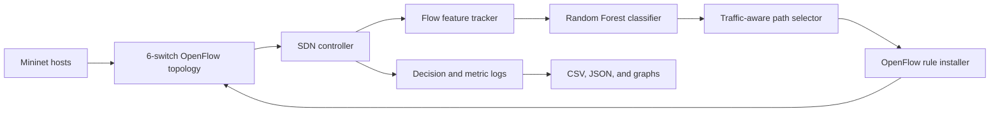
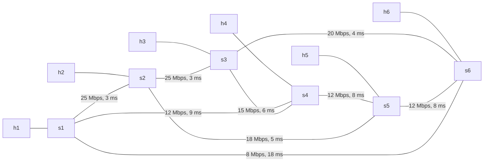
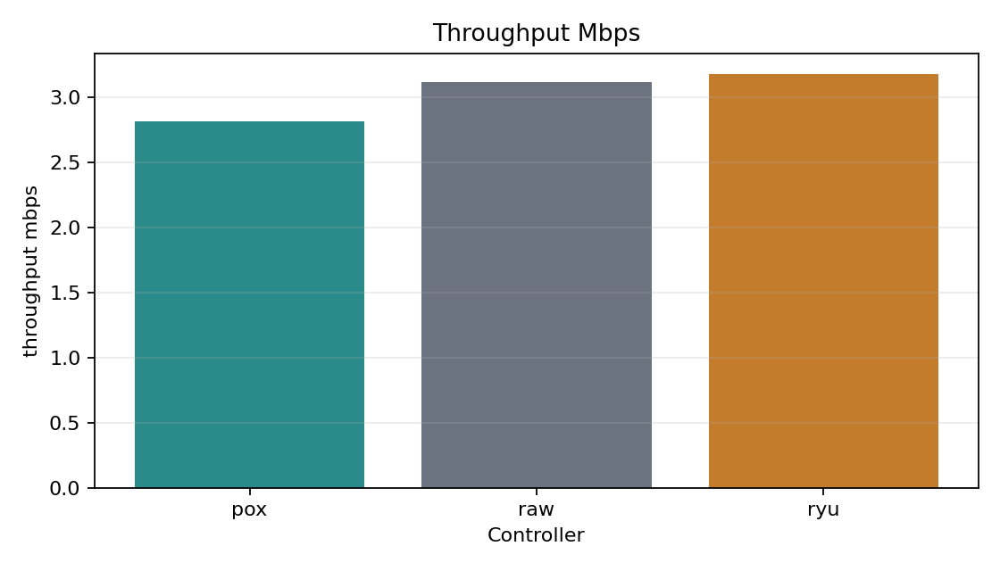
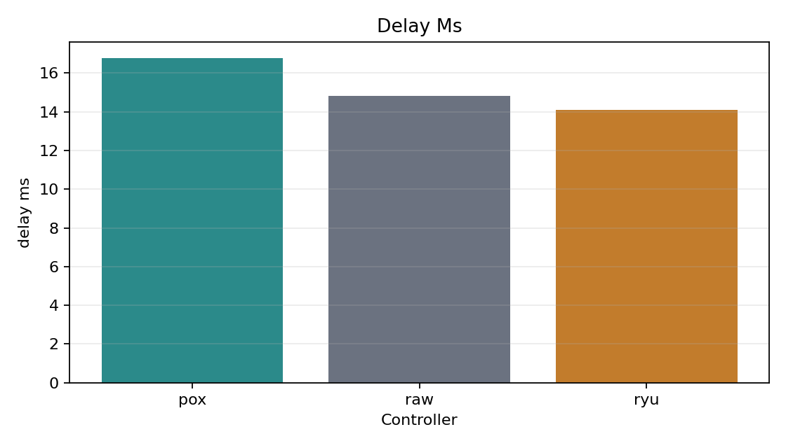
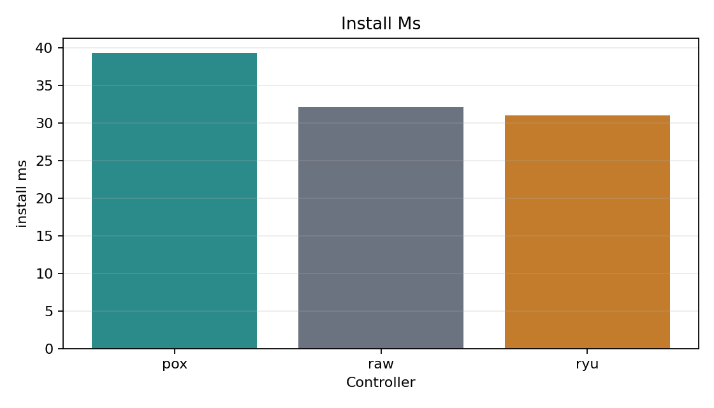
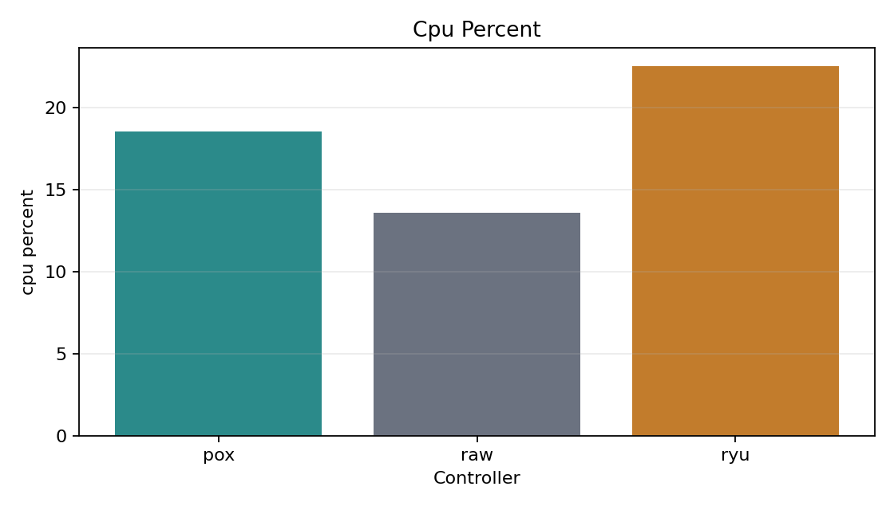
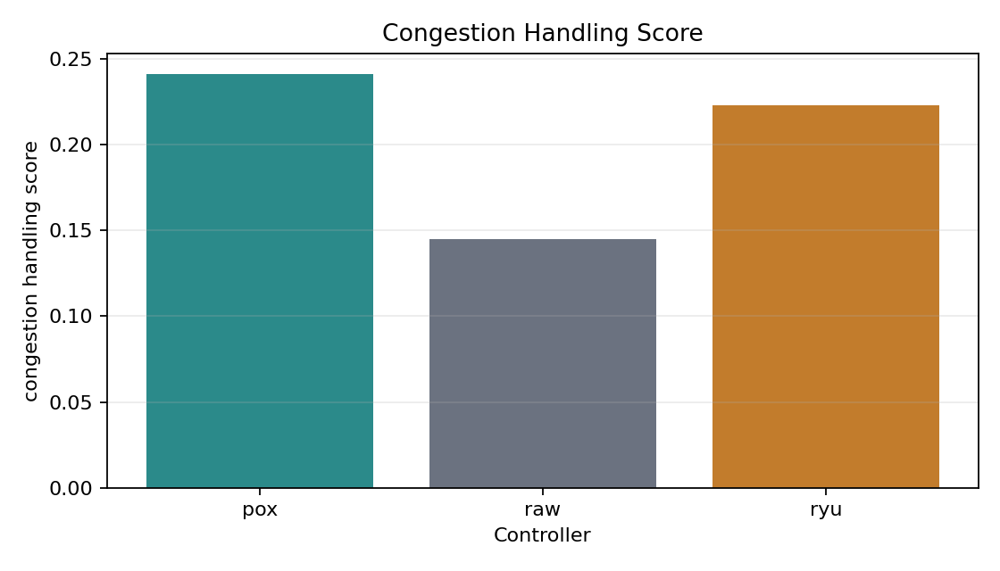
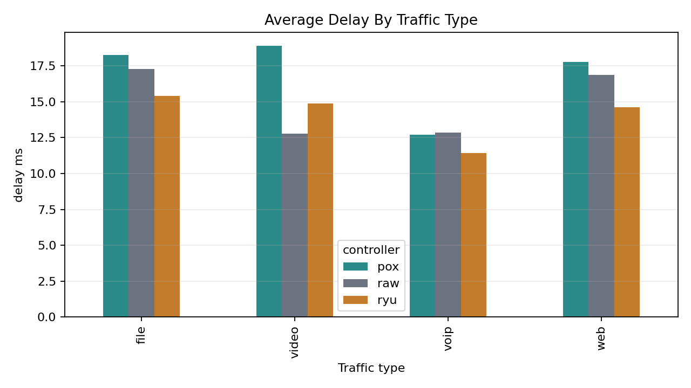

# AI-Assisted SDN Traffic Routing Simulation

This project is a complete software-defined networking simulation that does more than send every flow through one shortest path. It observes traffic, classifies the flow type with a Random Forest model, and then chooses a route based on the needs of that traffic.

The project is built so that you can understand the whole system from the README alone during an interview or viva:

- what the project does,
- how the network is laid out,
- how the AI model is trained and used,
- how routing decisions are made,
- how congestion changes those decisions,
- what each controller implementation does,
- what the results mean,
- and where every important file lives.

## One-Sentence Summary

The project builds a small virtual SDN network where the controller inspects new flows, classifies them as VoIP, video, file transfer, or web traffic, and installs OpenFlow rules on a path chosen according to delay, bandwidth, and congestion priorities.

## What Problem It Solves

Normal routing often treats all traffic the same. That works poorly for real applications because:

- VoIP needs very low delay.
- Video needs high bandwidth and stable delivery.
- File transfer needs throughput more than anything else.
- Web traffic needs balanced routing and congestion awareness.

This project shows how SDN plus AI can route different traffic classes differently instead of using one fixed path for everything.

## High-Level Architecture



The first packet of a new flow reaches a switch with no matching rule, so the switch sends a `PacketIn` message to the controller. The controller:

1. extracts flow features,
2. classifies the traffic type,
3. calculates a path using traffic-specific weights,
4. installs OpenFlow rules on the chosen switches,
5. and records the decision.

The same shared decision logic is used by all three controller implementations.

## What Is Included

- A six-host, six-switch Mininet topology.
- Four traffic classes: VoIP, video, file transfer, and web browsing.
- A trained Random Forest classifier.
- Shared routing and congestion logic.
- Three controller implementations:
  - Ryu,
  - POX,
  - raw OpenFlow 1.0 socket controller.
- Synthetic comparison experiments.
- Real Mininet experiment support.
- Generated CSV, JSON, PNG, and JSONL outputs.

## Network Topology

The network has six hosts and six switches:

- Hosts: `h1` to `h6`
- Switches: `s1` to `s6`

Each host connects to one switch:

| Host | Switch |
|---|---|
| h1 | s1 |
| h2 | s2 |
| h3 | s3 |
| h4 | s4 |
| h5 | s5 |
| h6 | s6 |

The switch fabric includes multiple alternate routes with different bandwidth and delay values:

| Link | Bandwidth | Delay |
|---|---:|---:|
| s1-s2 | 25 Mbps | 3 ms |
| s2-s3 | 25 Mbps | 3 ms |
| s3-s6 | 20 Mbps | 4 ms |
| s1-s4 | 12 Mbps | 9 ms |
| s4-s5 | 12 Mbps | 8 ms |
| s5-s6 | 12 Mbps | 8 ms |
| s2-s5 | 18 Mbps | 5 ms |
| s3-s4 | 15 Mbps | 6 ms |
| s1-s6 | 8 Mbps | 18 ms |

This matters because traffic-aware routing only makes sense when there are multiple possible paths.

### Topology View



## Traffic Classes

The project models four traffic types:

| Class | Behavior | Main Need | Example Ports |
|---|---|---|---|
| VoIP | Small, frequent UDP packets | Very low delay | 5060, 5061, 10000-10002 |
| Video | Large, steady UDP packets | High bandwidth, stable delay | 5004, 5005, 1935, 8554 |
| File | Bulk TCP transfer | Maximum throughput | 20, 21, 989, 990, 8081 |
| Web | Irregular TCP bursts | Balanced routing, congestion awareness | 80, 443, 8080, 8443 |

These classes are defined in `common/traffic_types.py`.

## AI Traffic Classification

The AI part uses a Random Forest classifier trained on synthetic labelled flow data.

### Features used by the model

- `packet_size`
- `interarrival_ms`
- `src_port`
- `dst_port`
- `service_port`

### Training pipeline

1. `ai/generate_training_data.py` creates synthetic labelled rows.
2. `ai/train_model.py` trains and evaluates the model.
3. `ai/classifier.py` loads the saved model for runtime predictions.

The trained model is saved as `models/traffic_rf.joblib`.

### Why the training data is noisy

The generated data intentionally includes realistic variation so the model cannot just memorize one exact port pattern. The generator includes:

- packet-size jitter,
- timing jitter,
- occasional burst outliers,
- and shared encrypted/web ports such as 443, 8080, and 8443.

That makes the classification task closer to real network traffic.

### Important note

If the model file is missing, the controllers fall back to port-based classification so the project still runs. That fallback is useful for startup, but it is not the AI path.

## Traffic-Aware Routing

Routing is handled in `common/routing.py`.

The controller does not simply choose the fewest hops. Instead, it scores complete paths using a weighted cost that depends on the traffic class.

The path score considers:

- delay,
- bandwidth,
- current congestion,
- and loss.

Different traffic types use different priorities:

| Class | Delay Weight | Bandwidth Weight | Congestion Weight |
|---|---:|---:|---:|
| VoIP | 0.70 | 0.10 | 0.20 |
| Video | 0.25 | 0.50 | 0.25 |
| File | 0.05 | 0.80 | 0.15 |
| Web | 0.35 | 0.25 | 0.40 |

That means the same source and destination can produce different routes depending on whether the flow is a call, a video stream, a file download, or web traffic.

## Congestion Handling

The project also estimates congestion on each inter-switch link.

When a link becomes heavily loaded:

- lower-priority traffic can be rerouted,
- VoIP is protected from rerouting,
- and the controller records the change.

Priority order:

| Class | Priority |
|---|---:|
| VoIP | 4 |
| Video | 3 |
| Web | 2 |
| File | 1 |

This matches the idea that a call should be preserved before a file transfer.

## Controller Implementations

The project includes three ways to run the same decision logic.

### Ryu

File: `controllers/ryu_ai_controller.py`

Ryu is the modern event-driven implementation. It listens for `PacketIn` events, parses packets, asks the shared controller brain what to do, and installs OpenFlow rules.

Run:

```bash
ryu-manager --ofp-tcp-listen-port 6633 controllers/ryu_ai_controller.py
```

### POX

File: `controllers/pox_ai_controller.py`

POX is the lightweight, older controller version. It follows the same shared routing and classification logic but uses POX events and messages.

Run:

```bash
PYTHONPATH="$PWD:$PYTHONPATH" /path/to/pox/pox.py controllers.pox_ai_controller
```

### Raw OpenFlow Controller

File: `controllers/raw_openflow_controller.py`

This version shows the low-level protocol details directly. It opens a TCP socket, speaks OpenFlow 1.0, parses packets manually, and builds OpenFlow messages by hand.

Run:

```bash
python3 -m controllers.raw_openflow_controller --port 6633
```

## Shared Controller Brain

The real decision-making lives in `common/controller_logic.py`.

For each packet, the shared brain:

1. identifies the source and destination hosts,
2. updates flow statistics,
3. classifies the traffic type,
4. chooses or reuses a path,
5. checks whether congestion requires rerouting,
6. decays old link utilization estimates,
7. and returns the decision to the controller implementation.

This keeps Ryu, POX, and raw OpenFlow aligned with the same routing policy.

## Experiments and Outputs

There are two ways to evaluate the project.

### 1. Synthetic comparison

This runs on a normal Python machine without Mininet and produces repeatable comparison outputs.

Run:

```bash
python -m pip install -r requirements.txt
python -m ai.train_model
python -m experiments.run_comparison --events 240 --output-dir results
```

Outputs include:

- `comparison_raw.csv`
- `comparison_summary.csv`
- `comparison_summary.json`
- `throughput_mbps.png`
- `delay_ms.png`
- `install_ms.png`
- `cpu_percent.png`
- `congestion_handling_score.png`
- `delay_by_traffic_type.png`

### 2. Mininet run

This is the real virtual-network version and requires Linux or WSL2.

Run the setup:

```bash
sudo apt update
sudo apt install -y mininet openvswitch-switch iperf python3-pip
python3 -m pip install -r requirements-mininet.txt
python3 -m ai.train_model --regenerate-data
```

Then start one controller and launch the Mininet topology:

```bash
sudo env PYTHONPATH="$PWD" python3 -m topologies.run_mininet_experiment \
  --controller-ip 127.0.0.1 \
  --controller-port 6633 \
  --profile mixed \
  --duration 30 \
  --output results/mininet_run.json
```

The repository also contains verified WSL2 Mininet outputs:

- `results/mininet_ryu_wsl_run.json`
- `results/mininet_pox_wsl_run.json`
- `results/mininet_raw_wsl_run.json`

## Visual Results

These diagrams are included directly in the README so the repository page shows the main results immediately.













## Main Files

- `common/topology.py`: host, switch, link, and port map.
- `common/routing.py`: path scoring, congestion logic, and reroute decisions.
- `common/controller_logic.py`: shared controller brain used by all controller types.
- `common/flow_features.py`: flow statistics and prediction features.
- `common/traffic_types.py`: traffic labels, profiles, and weights.
- `ai/generate_training_data.py`: synthetic labelled data creation.
- `ai/train_model.py`: model training and evaluation.
- `ai/classifier.py`: model loading and prediction.
- `controllers/ryu_ai_controller.py`: Ryu controller.
- `controllers/pox_ai_controller.py`: POX controller.
- `controllers/raw_openflow_controller.py`: raw OpenFlow controller.
- `topologies/six_switch_topology.py`: Mininet topology.
- `topologies/run_mininet_experiment.py`: real Mininet experiment runner.
- `experiments/run_comparison.py`: synthetic comparison and graph generation.
- `experiments/inspect_path_choices.py`: inspect which path each traffic class prefers.
- `traffic/profiles.py`: server/client traffic templates.
- `traffic/mininet_traffic_driver.py`: starts and stops traffic in Mininet.
- `traffic/web_bursts.py`: irregular web-request traffic generator.
- `docs/TECHNICAL_DOCUMENT.md`: deeper technical explanation.
- `PROJECT_A_TO_Z_GUIDE.md`: beginner-to-viva explanation of the full project.

## How the Project Works End to End

The full flow is:

1. A host sends the first packet of a new flow.
2. The switch has no matching rule, so it asks the controller.
3. The controller extracts flow features.
4. The Random Forest predicts the traffic class.
5. The routing logic chooses a path based on that class.
6. The controller installs OpenFlow rules along the path.
7. Later packets go directly through the switches.
8. The controller tracks congestion and can reroute lower-priority flows.
9. The experiment scripts collect measurements and create graphs.

In short:

**Observe -> Classify -> Weight -> Choose -> Install -> Forward -> Measure**

## What You Should Know for an Interview

If someone asks you what this project is, a strong answer is:

> This is an AI-assisted SDN traffic-aware routing project. It classifies flows into VoIP, video, file, or web traffic using a Random Forest model trained on flow features, then chooses a route based on delay, bandwidth, and congestion priorities. The same shared decision logic runs in Ryu, POX, and a raw OpenFlow controller, and the project includes both synthetic comparison experiments and real Mininet-based runs.

If they ask deeper questions, be ready to explain:

- why VoIP gets the highest priority,
- why bandwidth matters more for file/video traffic,
- why the model uses ports, packet size, and interarrival time,
- why there are three controller implementations,
- and why the same traffic can be routed differently depending on class.

## Limitations

This is a working project, but it still has limits:

- The classifier is trained on synthetic data, not real packet captures.
- The synthetic benchmark uses estimated overheads rather than live process profiling.
- Link utilization is estimated rather than polled from real switch counters.
- The current routing search is fine for a small topology, but it is not meant for large-scale networks.
- Reroute decisions are made by the controller logic, but the project is still a simulation rather than a production SDN system.

## Quick Start

For the synthetic run:

```bash
python -m pip install -r requirements.txt
python -m ai.train_model
python -m experiments.run_comparison --events 240 --output-dir results
```

For Mininet on Linux:

```bash
sudo apt update
sudo apt install -y mininet openvswitch-switch iperf python3-pip
python3 -m pip install -r requirements-mininet.txt
python3 -m ai.train_model --regenerate-data
```

Then start a controller and run the topology.

## Final Takeaway

This project combines SDN, OpenFlow, routing, congestion awareness, and machine learning into one small but complete network simulation.

It is designed so that you can explain:

- the network,
- the AI model,
- the routing policy,
- the controller logic,
- the experiments,
- and the results

without needing to open any other document.
