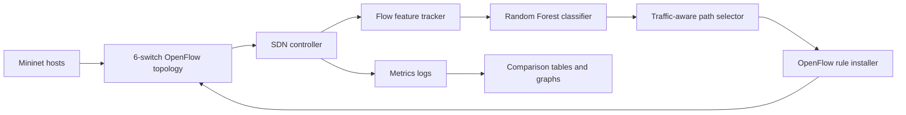

# AI-Assisted Traffic-Aware SDN Routing Simulation

## 1. Goal

The goal is to build a simulated network that does more than forward every flow through the same shortest path. The network observes flow features, classifies the traffic type with a machine-learning model, and then selects a path that matches the flow's needs.

VoIP is routed toward low delay. File transfers are routed toward high bandwidth. Video and web traffic use a more balanced score that considers delay, bandwidth, and congestion.

The project is software-only. Mininet supplies the virtual switches and hosts, Open vSwitch supplies OpenFlow switches, and Python is used for the AI model, routing logic, controllers, traffic tools, and experiment analysis.

## 2. Architecture



The controller receives a PacketIn when a switch does not yet have a rule for a flow. The controller extracts packet size, ports, protocol, and arrival timing. These features are passed to the classifier. The chosen traffic label controls the routing weights. The controller then installs OpenFlow rules along the selected switch path.

The same shared brain lives in `common/controller_logic.py`, so Ryu, POX, and the raw controller use the same classification and routing policy.

## 3. Simulated Network

The topology has six hosts and six switches:

- `h1` to `h6`
- `s1` to `s6`

Each host connects to one switch:

| Host | Switch |
|---|---|
| h1 | s1 |
| h2 | s2 |
| h3 | s3 |
| h4 | s4 |
| h5 | s5 |
| h6 | s6 |

The switch fabric has multiple possible routes:

| Link | Bandwidth | Delay |
|---|---:|---:|
| s1-s2 | 25 Mbps | 3 ms |
| s2-s3 | 25 Mbps | 3 ms |
| s3-s6 | 20 Mbps | 4 ms |
| s1-s4 | 12 Mbps | 9 ms |
| s4-s5 | 12 Mbps | 8 ms |
| s5-s6 | 12 Mbps | 8 ms |
| s2-s5 | 18 Mbps | 5 ms |
| s3-s4 | 15 Mbps | 6 ms |
| s1-s6 | 8 Mbps | 18 ms |

This gives the controller real choices. For example, `s1` to `s6` has a direct but low-bandwidth path, a low-delay multi-hop path through `s2` and `s3`, and alternate paths through `s4` and `s5`.

The topology code is in `topologies/six_switch_topology.py`.

## 4. Traffic Types

The project models four traffic classes:

| Class | Behavior | Need | Example ports |
|---|---|---|---|
| VoIP | Small UDP packets sent frequently | Low delay | 5060, 5061, 10000-10002 |
| Video | Large steady UDP packets | High bandwidth and stable delay | 5004, 5005, 1935, 8554 |
| File | Bulk TCP transfer | Maximum throughput | 20, 21, 989, 990, 8081 |
| Web | Small irregular TCP bursts | Balanced, avoid congestion | 80, 443, 8080, 8443 |

Traffic definitions are in `common/traffic_types.py` and Mininet command templates are in `traffic/profiles.py`.

In Mininet, the traffic generator uses `iperf` for VoIP, video, and file flows. Web browsing is modeled with irregular HTTP requests from `traffic/web_bursts.py`.

## 5. AI Traffic Classifier

The classifier is a Random Forest trained on synthetic labelled flow samples. The features are:

- `packet_size`
- `interarrival_ms`
- `src_port`
- `dst_port`
- `service_port`, the lower of the two ports

Training files:

- `ai/generate_training_data.py`
- `ai/train_model.py`
- `ai/classifier.py`

Train with:

```bash
python -m ai.train_model --regenerate-data
```

The synthetic generator deliberately adds realistic ambiguity without changing
the correct labels. Packet sizes and interarrival times receive measurement
jitter, occasional application bursts produce outliers, and 35% of samples use
shared ports such as 443, 8080, or 8443. This prevents the model from solving
the task only by memorizing one unique port set per class.

The Mininet links also use `tc netem` delay jitter. The routing algorithm keeps
the configured nominal delay for path scoring, while packets experience small
real-time delay variations during an experiment.

The trained model is saved as `models/traffic_rf.joblib`. A model report is saved as `results/model_report.json`.

If a controller starts before the model exists, it falls back to port-based classification. That makes the project easier to start while still supporting the requested Random Forest model once trained.

## 6. Traffic-Aware Routing

Routing is implemented in `common/routing.py`. It uses Dijkstra's algorithm, but the edge cost is not simple hop count.

Each link has:

- delay in milliseconds
- bandwidth in Mbps
- current utilization
- loss percentage

The weighted edge cost is:

```text
cost =
  traffic_delay_weight * delay
  + traffic_bandwidth_weight * inverse_bandwidth
  + traffic_congestion_weight * utilization
  + loss_penalty
```

Each traffic type has different weights:

| Class | Delay weight | Bandwidth weight | Congestion weight |
|---|---:|---:|---:|
| VoIP | 0.70 | 0.10 | 0.20 |
| Video | 0.25 | 0.50 | 0.25 |
| File | 0.05 | 0.80 | 0.15 |
| Web | 0.35 | 0.25 | 0.40 |

This means the same source and destination can produce different routes depending on the traffic type.

Run this to inspect path choices:

```bash
python -m experiments.inspect_path_choices
```

## 7. Congestion Handling

The controller tracks estimated utilization on every switch-to-switch link. When a link crosses the congestion threshold, lower-priority traffic is eligible for rerouting.

Priority order:

| Class | Priority |
|---|---:|
| VoIP | 4 |
| Video | 3 |
| Web | 2 |
| File | 1 |

VoIP is protected because moving a call can harm quality. Lower-priority traffic, especially file transfers, can be moved to another route when congestion appears.

The key functions are:

- `overloaded_links()`
- `should_reroute()`
- `apply_flow_load()`
- `decay_utilization()`

These are in `common/routing.py`.

## 8. Controller Implementations

### Ryu

File: `controllers/ryu_ai_controller.py`

Ryu provides a modern event-driven controller framework. The implementation listens for PacketIn events, parses packets with Ryu's packet library, calls the shared controller brain, and installs OpenFlow 1.0 rules with Ryu parser objects.

Run:

```bash
ryu-manager --ofp-tcp-listen-port 6633 controllers/ryu_ai_controller.py
```

### POX

File: `controllers/pox_ai_controller.py`

POX is lightweight and older. The POX implementation follows the same logic but uses POX's OpenFlow message classes and event names.

Run:

```bash
PYTHONPATH="$PWD:$PYTHONPATH" /path/to/pox/pox.py controllers.pox_ai_controller
```

If POX is not already installed, use a checkout outside the project:

```bash
git clone --depth 1 https://github.com/noxrepo/pox.git ~/pox_tmp
cp controllers/pox_ai_controller.py ~/pox_tmp/ext/pox_ai_controller.py
PYTHONPATH="$PWD:$HOME/pox_tmp:$PYTHONPATH" python3 ~/pox_tmp/pox.py pox_ai_controller
```

### Raw OpenFlow Controller

File: `controllers/raw_openflow_controller.py`

The raw controller does not use a controller framework. It opens a TCP socket, performs a minimal OpenFlow 1.0 handshake, receives PacketIn messages, parses Ethernet/IP/TCP/UDP headers manually, and writes PacketOut and FlowMod messages using `struct`.

Run:

```bash
python -m controllers.raw_openflow_controller --port 6633
```

This controller is intentionally smaller than Ryu or POX, but it demonstrates the low-level mechanics hidden by frameworks.

## 9. Running End to End

### Synthetic mode

Synthetic mode is useful for development on Windows or on machines without Mininet.

```bash
python -m pip install -r requirements.txt
python -m ai.train_model
python -m experiments.run_comparison --events 240 --output-dir results
```

This runs all three controller profiles through the same AI and routing logic and produces graphs and tables.

### Mininet mode

Mininet mode requires Linux.

Install:

```bash
sudo apt update
sudo apt install -y mininet openvswitch-switch iperf python3-pip
python3 -m pip install -r requirements-mininet.txt
python3 -m ai.train_model
```

Start a controller in terminal 1:

```bash
python3 -m controllers.raw_openflow_controller --port 6633
```

Run topology and traffic in terminal 2:

```bash
sudo env PYTHONPATH="$PWD" python3 -m topologies.run_mininet_experiment \
  --controller-ip 127.0.0.1 \
  --controller-port 6633 \
  --profile mixed \
  --duration 30 \
  --output results/mininet_run.json
```

Repeat with the Ryu and POX controllers for a full controller comparison.

The WSL2 validation run produced these real Mininet metrics:

| Controller | Ping loss | h1-h6 iperf | Output |
|---|---:|---|---|
| Ryu | 0% | 19.0 / 18.9 Mbits/sec | `results/mininet_ryu_wsl_run.json` |
| POX | 0% | 19.0 / 18.9 Mbits/sec | `results/mininet_pox_wsl_run.json` |
| Raw | 0% | 19.0 / 18.9 Mbits/sec | `results/mininet_raw_wsl_run.json` |

## 10. Performance Comparison

The synthetic comparison writes:

| Output | Purpose |
|---|---|
| `results/comparison_raw.csv` | Per-flow measurements |
| `results/comparison_summary.csv` | Controller-level summary |
| `results/comparison_summary.json` | JSON version of the summary |
| `results/throughput_mbps.png` | Throughput graph |
| `results/delay_ms.png` | Delay graph |
| `results/install_ms.png` | Rule install timing graph |
| `results/cpu_percent.png` | CPU estimate graph |
| `results/congestion_handling_score.png` | Congestion response graph |
| `results/delay_by_traffic_type.png` | Delay split by traffic class |

The local smoke run produced a comparison table similar to:

| Controller | Throughput Mbps | Delay ms | Install ms | CPU % | Reroutes | Congestion score |
|---|---:|---:|---:|---:|---:|---:|
| POX | 2.87 | 18.31 | 37.18 | 18.42 | 16 | 0.308 |
| Raw | 3.09 | 18.43 | 32.74 | 14.20 | 18 | 0.277 |
| Ryu | 2.65 | 17.54 | 34.99 | 24.06 | 21 | 0.300 |

These numbers are from the synthetic model and are meant for repeatable comparison of the project logic. For Mininet runs, use `results/mininet_run.json` plus the per-controller decision logs written by each controller.

## 11. Reproducibility Notes

- Use Python 3.10 or newer.
- Train the model before running controllers for true Random Forest classification.
- Mininet should be run with `sudo`.
- Keep `PYTHONPATH` pointed at the project root when launching Mininet, Ryu, or POX from another directory.
- The topology uses OpenFlow 1.0 because POX and the raw controller are easiest to compare on that version.

## 12. Limitations and Extensions

This is a complete runnable project, but it is still a simulation. The synthetic runner estimates controller overhead and CPU rather than measuring real controller processes. Real Mininet runs give more realistic forwarding behavior, while the synthetic runner is better for fast repeatable development.

Useful next extensions:

- Add real switch port statistics polling in Ryu and POX.
- Export controller decision logs into the same comparison CSV format.
- Add more traffic classes such as DNS, gaming, and SSH.
- Replace synthetic labels with packet captures from real applications.
